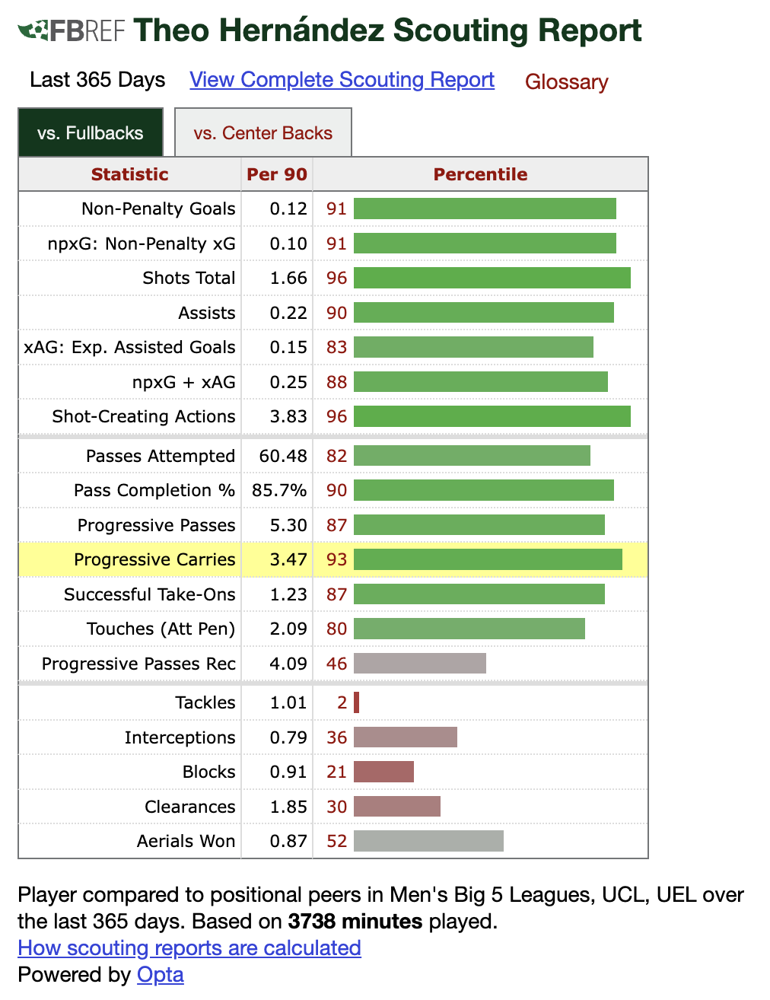

# LoL analytics with Streamlit

---

# A step back: MOBAs

From Wikipedia:
> Multiplayer online battle arena (MOBA) is a subgenre of strategy video games in which two teams of players compete against each other on a predefined battlefield. Each player controls a single character with a set of distinctive abilities that improve over the course of a game and which contribute to the team's overall strategy. The typical objective is for each team to destroy their opponents' main structure, located at the opposite corner of the battlefield.

---

---

# Another step back: Moneyball

From Wikipedia:
> In association football, expected goals (xG) is a performance metric used to evaluate team and player performances. It can be used to represent the probability of a scoring opportunity that may result in a goal.

---

  
   

---

# The gold standard for football data

  
   

